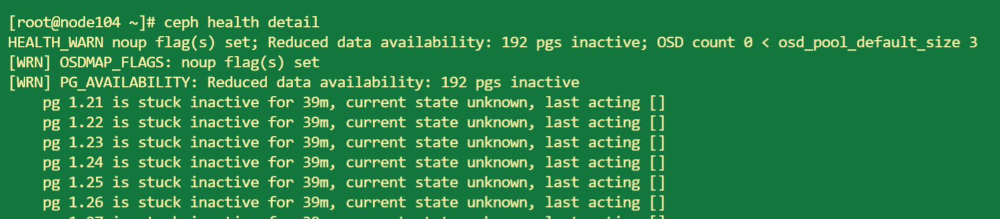

# **Ceph: Status shows "Reduced data availability: xx pgs inactive, xx pgs peering"**

## 问题：

```
ceph -s
```


## 排查：

1. 查看 ceph 集群健康状态详细信息

   ```
   ceph health detail
   ```

   

   ```
   ceph osd tree
   ```

   

   

   - `noup` ：`OSDMAP_FLAGS: noup flag(s) set` 表示有一些 osd 节点没有处理 IO
     可以使用 `ceph osd dump | grep noup` 来检查 osd 的状态
   - `Reduced data availability: 192 pgs inactive` 和 `pg 1.21 is stuck inactive for 45m` 表示部分 PG（Placement Group，分布式存储的数据单元）处于不活动状态。

   - osd 树中没有显示任何 osd，说明当前没有任何正常运行状态的 osd，可能的原因有：

     - osd 宕机或者离线，需要检查每个 osd 的状态，确认这些 osd 是否正在运行和正常连接到集群

       ```
       ceph osd stat
       ```

       

     - 集群配置问题：如果 osd 在配置文件中未正确配置或没有在集群中注册，也会导致 osd 无法正常运行

       

## 尝试解决：

